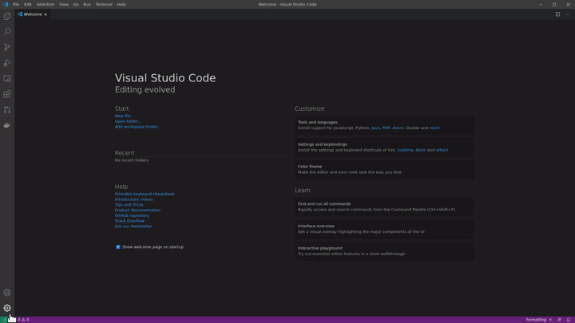
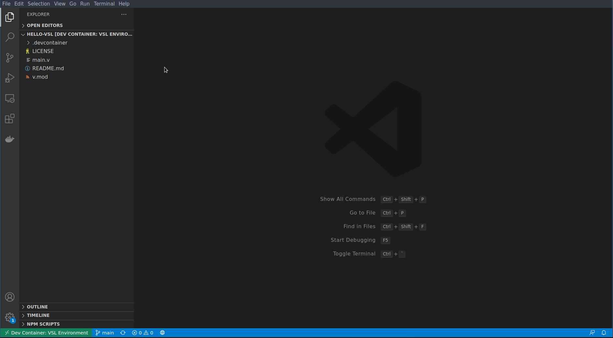

# VSL &ndash; V scientific library (Hello World)

This simple example is a start point for developing applications with VSL.

To run this code:

1. Install Docker
2. Install Visual Studio Code
3. Install the Remote Development extension for VS Code
4. Clone <https://github.com/ulises-jeremias/hello-vsl>
5. Create your application within a container (see gif below)

Then you can select "Open Folder in Container" in VS Code (see below).

Done. And your system will remain "clean".

Our [Docker Image](https://hub.docker.com/repository/docker/vsl/vsl) also contains V and the V Tools for working with VS Code (or not). Below is a video showing the convenience of VS Code + the V tools + VSL.

